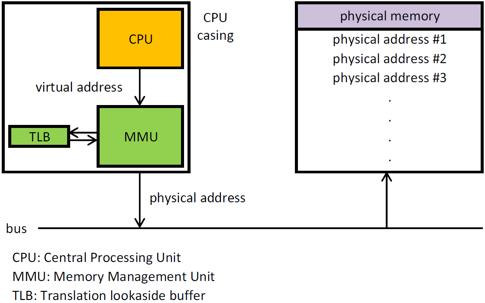
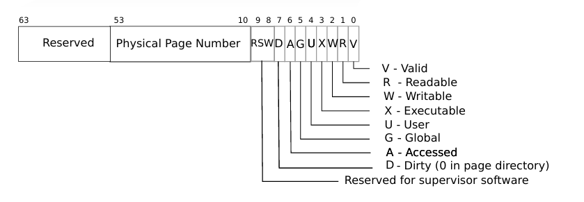
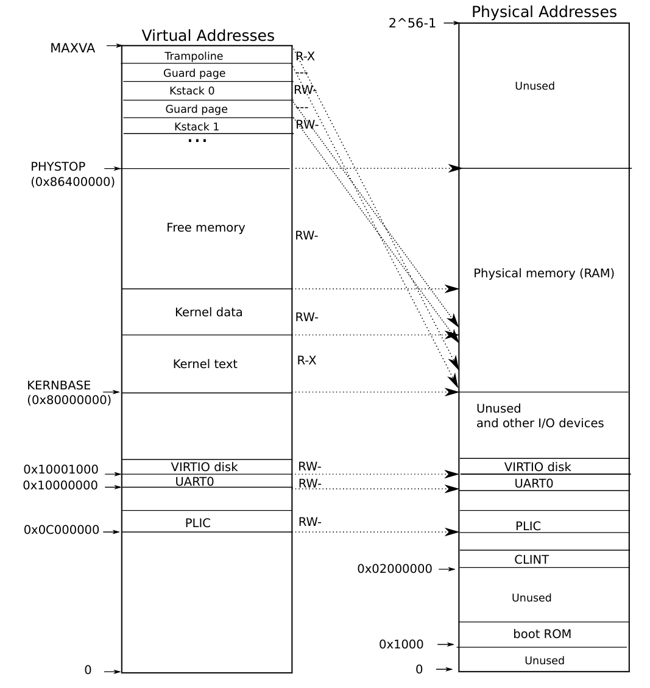
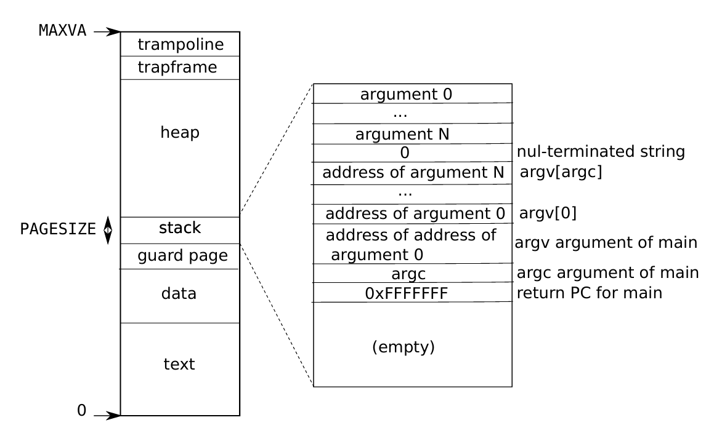

# LEC 4 - Page tables & Virtual Memory

> - **Issue:** A shell process has a bug that occasionally writes to random memory addresses.
> - **Solution:** page table allow xv6 to isolate different process’s address spaces and to multiplex them onto a single physical memory.

## 1. Paging Hardware

### Paging Hardware Architecture

- **CPU:** Generates virtual addresses (VA).
- **MMU:** Kernel configures MMU to map VAs to PAs via page tables (Page Walking).
- **RAM:** Physical memory storage.
- **Process:** Software interacts with virtual addresses.
### Page Walk

- **Page Size:** 4KB/4096Bytes (12-bit offset), each has 512 entry
- **Page Table Address:** 64-bit addresses in RISC-V used by xv6.
- **Virtual Address**: only the bottom 39 bits of a 64-bit VA are used
- **Page Table Entry (PTE):** (64 bits total)
    - **Physical Page Number (PPN):** Top 44 bits.
    - **Flags:** Low 10 bits (e.g., Present, Writable).
- **Three Level Page Walk**: If any of the three PTEs required to translate an address is not present, the paging hardware raises a page-fault exception, leaving it up to the kernel to handle the exception
- **TLB**: CPU caches page table entries in a Translation Look-aside Buffer (TLB).
- **`satp` register**: To enable hardware to use a page table, the kernel writes the physical address of the root page-table page into the satp register, which is unique to each CPU and used to translate addresses generated by subsequent instructions.
### Flags

- **PTE_V**: Indicates whether the page table entry (PTE) is present; if not set, a reference causes an exception.
- **PTE_R**: Controls whether the page can be read by instructions.
- **PTE_W**: Controls whether the page can be written to by instructions.
- **PTE_X**: Controls whether the CPU can interpret the page content as executable instructions.
- **PTE_U**: Controls whether user-mode instructions can access the page; if not set, only supervisor mode can access the page.
## 2. xv6 Address Space
> xv6 maintains one page table per process, plus a single page table for kernel's address space
### Kernel Address Space

- **Below `KERNBASE` (direct mapping):** Reserved for I/O devices and boot resources.  
- **`KERNBASE` ~ `PHYSTOP` (direct mapping):** Maps the kernel itself and free physical memory directly.  
- **`PHYSTOP` ~ `MAXVA` (indirect mapping):**  
  - **Double-Mapped Trampoline:** A physical page holding trampoline code is mapped twice in the kernel's virtual address space:  
    - At the top of the virtual address space for user-to-kernel transitions.  
    - With direct mapping for kernel execution.  
    - Trampoline mapping uses `PTE_R` and `PTE_X`, while other kernel pages use `PTE_R` and `PTE_W`.  
  - **Kernel Stacks:** Each process has its own kernel stack mapped high, with an unmapped guard page below.  
    - The guard page's invalid PTE (`PTE_V` unset) ensures that stack overflows cause an exception and kernel panic, protecting other kernel memory.  

### Process Address Space

- Each process has its own page table.
- User memory from 0 to MAXVA.
- `kalloc`: allocalte physical page, then adds PTE to process's page table

## 3. Code Walkthrough
### Page table data structure
**pagetable_t**: Pointer to the root page table, representing kernel or per-process page tables.
- **`walk`**:  Finds the page table entry (PTE) for a given virtual address by descending the 3-level page table. Allocates a new page-table page if needed and returns the PTE address.
- **`mappages`**:  Maps a range of virtual addresses to corresponding physical addresses. Calls `walk` for each virtual address, sets up PTEs with appropriate permissions, and marks them valid.
### Creating an address space in boot
- **`kvminit`**:  
  - Initializes the kernel’s page table by calling `kvmmake`.
  - Sets up translations for kernel instructions, data, physical memory, and device memory.
- **`kvmmake`**:  
  - Allocates a root page-table page and calls `kvmmap` to set up required mappings.
- **`proc_mapstacks`**:  
  - Allocates kernel stacks for processes and maps them with stack-guard pages using `kvmmap`.
- **`kvmmap`**:  
  - Maps virtual to physical addresses for kernel memory ranges by calling `mappages`.
- **`kvminithart`**:  
  - Installs the kernel page table by writing the physical address of the root page-table page into the `satp` register.
  - Executes the RISC-V `sfence.vma` instruction to flush the CPU’s TLB after reloading `satp`.
- **`copyout` / `copyin`**:  
  - Copy data between user space and kernel space, translating user virtual addresses to physical addresses.
- **TLB flushing**:  
  - Uses `sfence.vma` to flush the TLB after page table updates to prevent stale mappings.
  - Potentially uses Address Space Identifiers (ASIDs) for selective TLB flushing (if supported). 

### Kernel Memory Management System Call  
#### Heap Management (`sbrk(n)`)  
- **Grow Memory**: `growproc` → `uvmalloc` → allocate physical memory (`kalloc`) → add PTE to user page table (`mappages`).  
- **Shrink Memory**: `growproc` → `uvmdealloc` → `uvmunmap` (walk to unmap pages).  
#### `exec`: Creates User Address Space  
- **Open Binary**: Use `namei` to open the binary file, verify ELF header via magic number.  
- **Allocate Address Space**: Create new user page table, allocate memory for ELF segments (`uvmalloc`).  
- **Load ELF Segments**: Load segments using `loadseg`, zero-fill gaps between `filesz` and `memsz`.  
- **Initialize Stack**: Allocate one stack page, copy arguments, set up stack with return PC, `argc`, and `argv`.  
- **Error Handling**: On error, free new image, return -1; old image freed only after successful setup.  
- **Commit New Image**: Install new page table, free old one after ensuring success.  
- **Security Checks**: Validate ELF to prevent address overflows and ensure loading only affects process page table.  